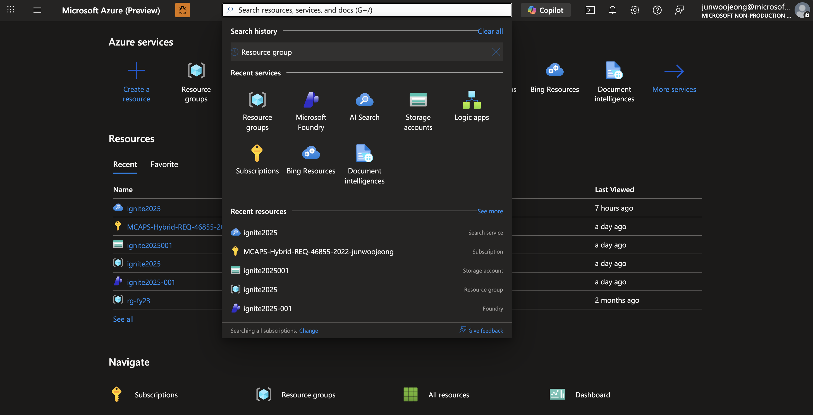
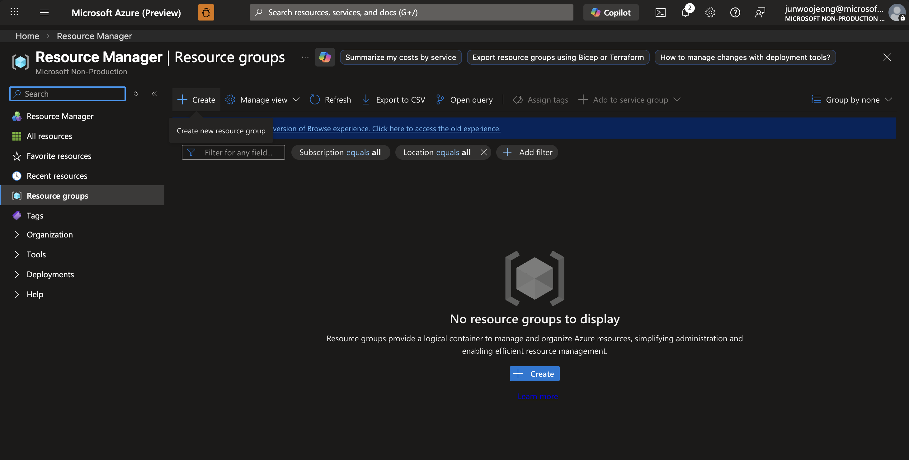
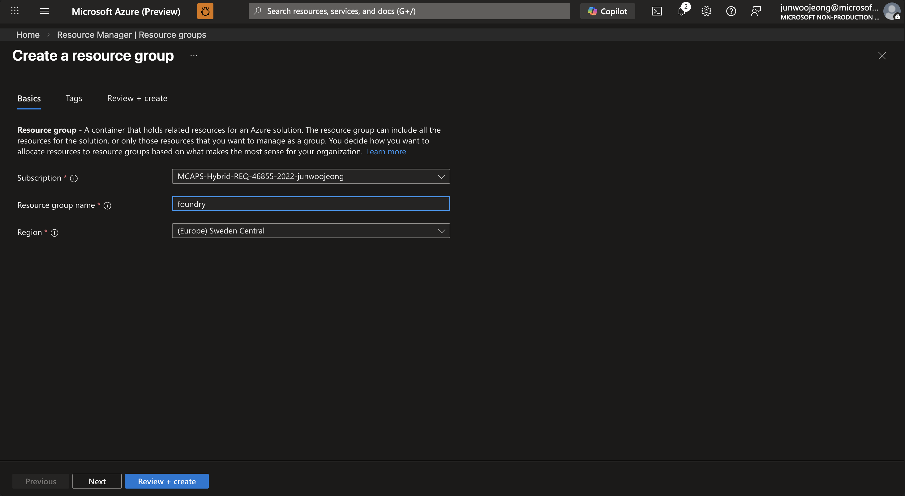
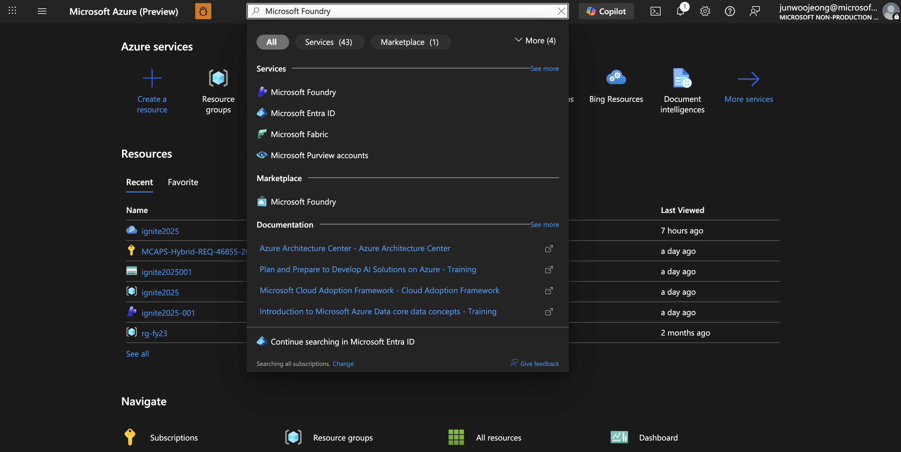
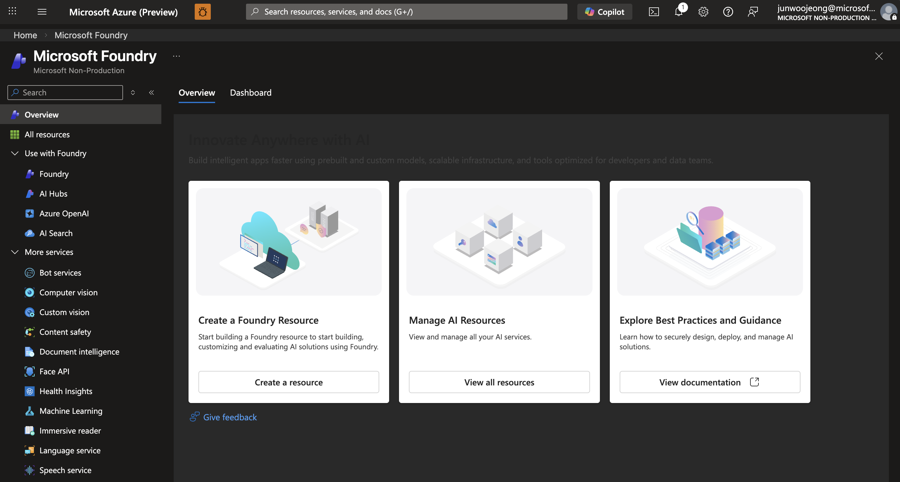
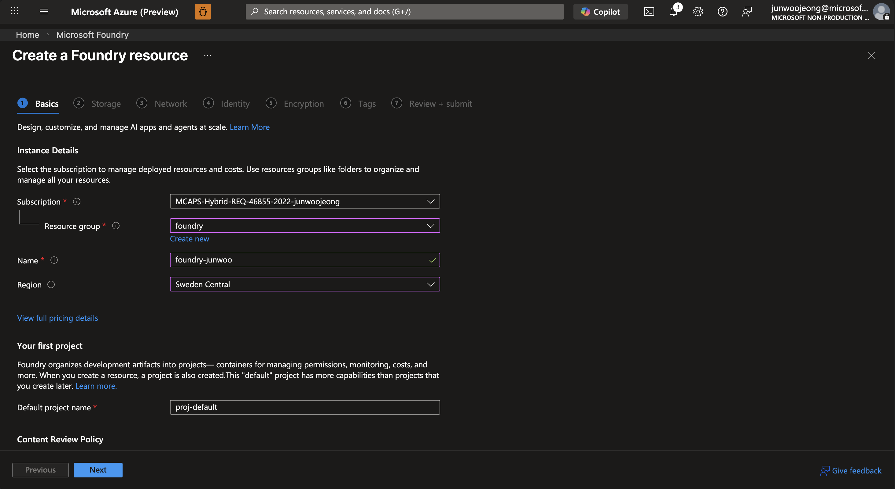
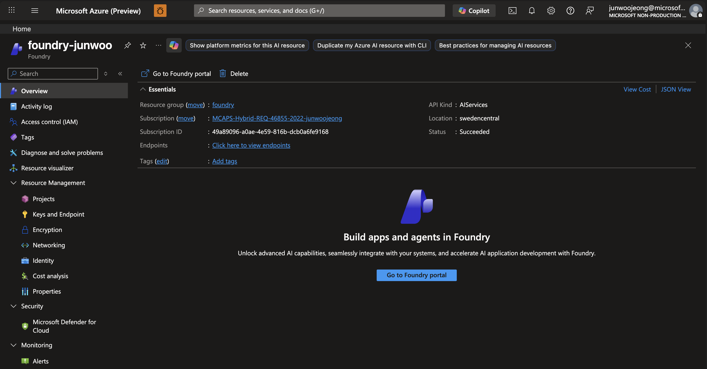
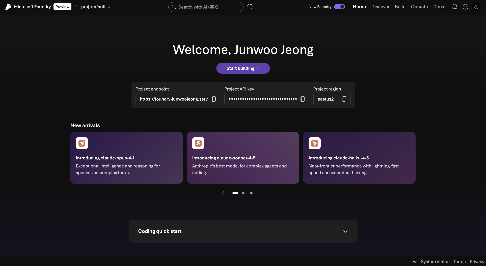
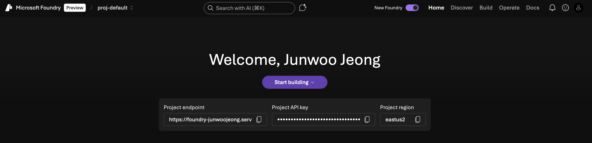
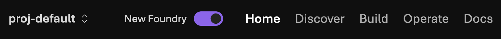

# 01. 환경 설정

이 모듈에서는 Microsoft Foundry 워크샵을 시작하기 위한 기본 환경을 설정합니다.

## 📋 목차

- [Resource Group 생성](#resource-group-생성)
- [Foundry 리소스 생성](#foundry-리소스-생성)
- [New Foundry 포털 활성화](#new-foundry-포털-활성화)
- [다음 단계](#다음-단계)

## 🎯 학습 목표

- Azure Resource Group 생성 방법 이해
- Microsoft Foundry 리소스 생성 및 구성
- 새로운 Foundry 포털 인터페이스 활성화

## ⏱️ 예상 소요 시간

약 10분

---

## Resource Group 생성

Resource Group은 Azure 리소스를 논리적으로 그룹화하는 컨테이너입니다.

### 단계별 가이드

1. **Azure Portal 접속**
   - [Azure Portal](https://portal.azure.com)에 로그인합니다.

2. **Resource Group 생성**
   - 상단 검색창에서 "Resource groups"를 검색합니다.
   
   
   
   - **+ Create** 버튼을 클릭합니다.
   
   

3. **기본 정보 입력**
   ```
   Subscription: [사용 중인 구독 선택]
   Resource group: foundry
   Region: East US 2 (또는 선호하는 리전)
   ```
   
   

4. **검토 및 생성**
   - **Review + create** 버튼을 클릭합니다.
   - 검증 완료 후 **Create** 버튼을 클릭합니다.

### ✅ 확인 사항

- Resource Group이 성공적으로 생성되었는지 확인
- Resource Group 이름: `foundry`

---

## Foundry 리소스 생성

Microsoft Foundry는 AI 애플리케이션 개발을 위한 통합 플랫폼입니다.

### 단계별 가이드

1. **Microsoft Foundry 리소스 검색**
   - Azure Portal 상단 검색창에서 "Microsoft Foundry"를 검색합니다.
   - 또는 직접 [Microsoft Foundry Portal](https://ai.azure.com)에 접속합니다.
   
   

2. **새 Foundry 리소스 & 프로젝트 생성**
   - **Create a Foundry Resource** 버튼을 클릭합니다.
   
   

   ```
   Resource group: foundry
   Name: foundry<Your unique name>
   Location: East US 2
   Default project name: proj-default
   ```

   - 필수정보를 입력하고 Foundry 리소스를 생성합니다.
   - **Review + create**를 클릭합니다.
   - 모든 설정을 확인한 후 **Create**를 클릭합니다.
   - 리소스 생성에는 2-5분 정도 소요됩니다.

   

   - **Foundry Resource** 개요 페이지로 이동합니다.

   

   - **Go to Foundry portal**를 클릭합니다. 

   

### ✅ 확인 사항

- Foundry 프로젝트가 성공적으로 생성되었는지 확인
- 프로젝트 이름: `proj-default`

---

## New Foundry 포털 활성화

새로운 Foundry 포털은 향상된 사용자 인터페이스와 추가 기능을 제공합니다.

### 단계별 가이드

1. **New Foundry 활성화**
   - 포털 상단 또는 설정 메뉴에서 **"Enable New Foundry"** 또는 **"Try new experience"** 옵션을 찾습니다.
   - 토글 스위치를 켜서 새로운 인터페이스를 활성화합니다.
   
   

2. **인터페이스 확인**
   - 새로운 포털 인터페이스가 로드되는지 확인합니다.
   - 우측 상단 메뉴에서 다음 섹션들이 보이는지 확인:
     - **Discover**: 모델, 템플릿 등 탐색
     - **Build**: 에이전트, 워크플로우, 모델 등 개발
     - **Operate**: 컨트롤 플레인 등 관리
   
   

### ✅ 확인 사항

- New Foundry 포털이 활성화되었는지 확인
- 좌측 메뉴에서 Discover, Build, Operate 섹션 확인
- 프로젝트 홈이 정상적으로 표시되는지 확인

---

## 📚 추가 리소스

- [Microsoft Foundry 문서](https://learn.microsoft.com/en-us/azure/ai-foundry/what-is-azure-ai-foundry?view=foundry)
- [Azure Resource Manager 개요](https://learn.microsoft.com/azure/azure-resource-manager/management/overview)
- [Azure 리전 및 가용성 영역](https://learn.microsoft.com/azure/reliability/availability-zones-overview)

---

## 다음 단계

환경 설정이 완료되었습니다! 이제 다음 모듈로 진행하세요:

➡️ **[02. 모델 및 배포](./02-models.md)**: 다양한 AI 모델을 탐색하고 배포하는 방법을 학습합니다.

---

[← 메인으로](./README.md) | [다음: 모델 및 배포 →](./02-models.md)
