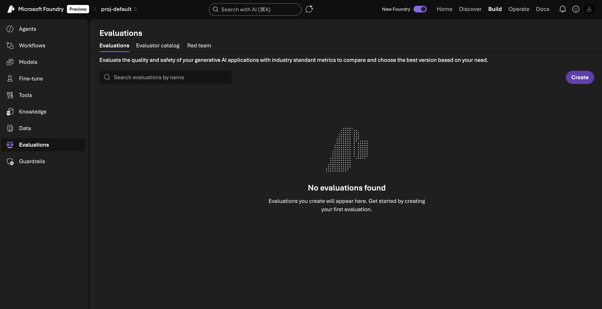
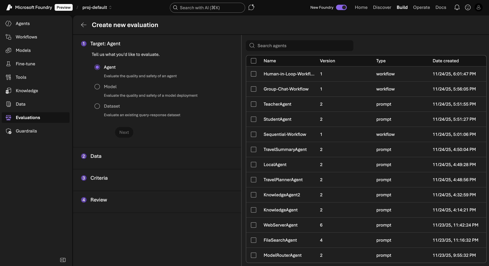
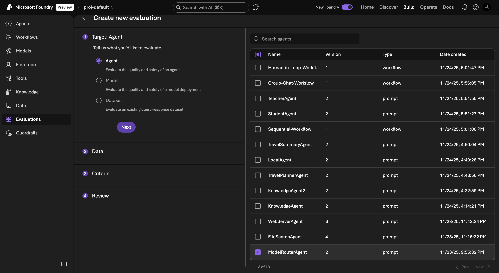
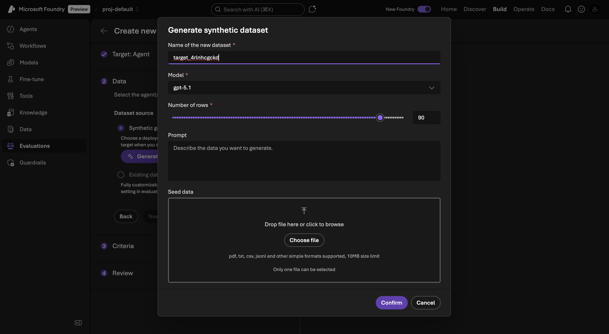
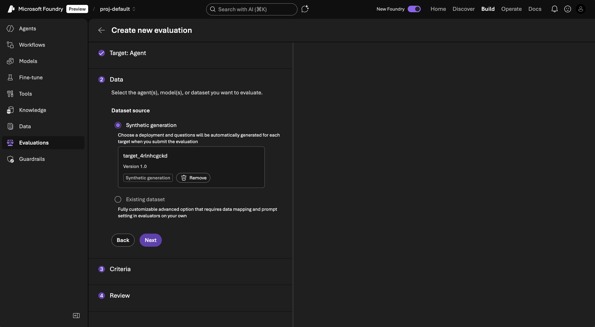
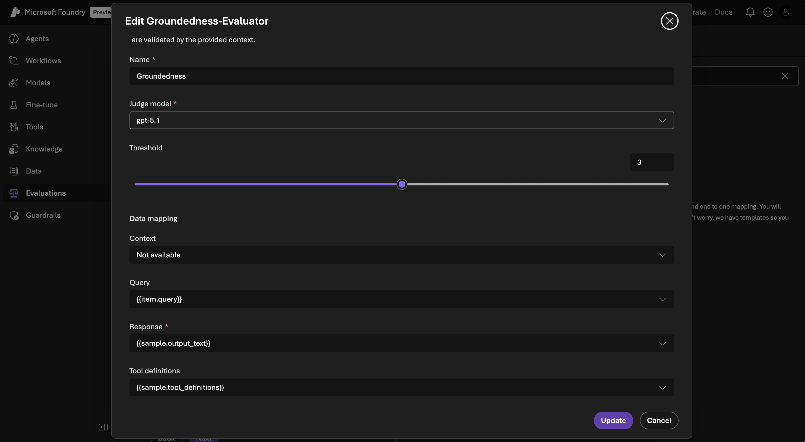
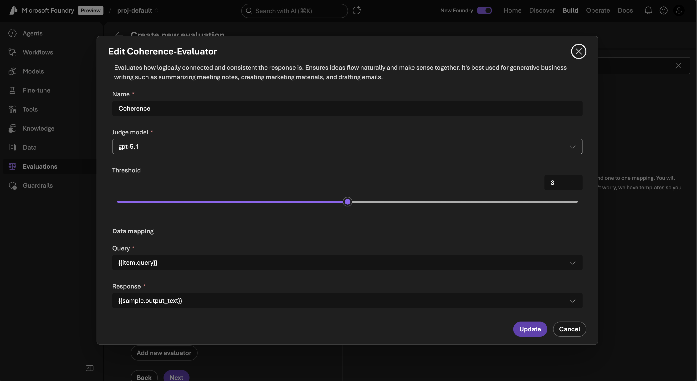
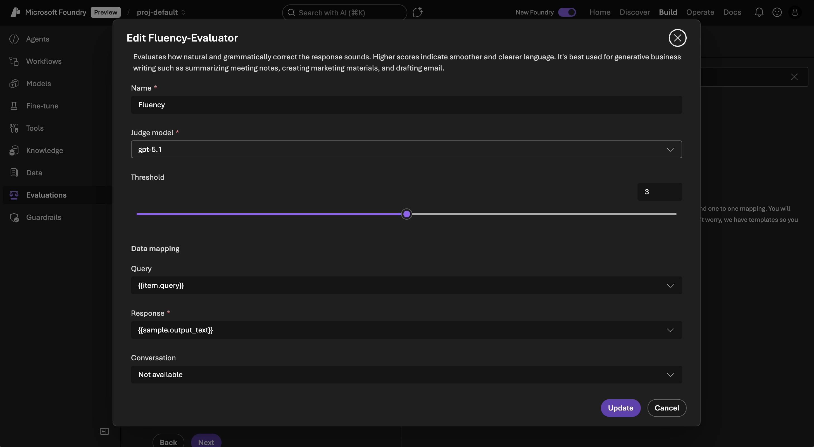
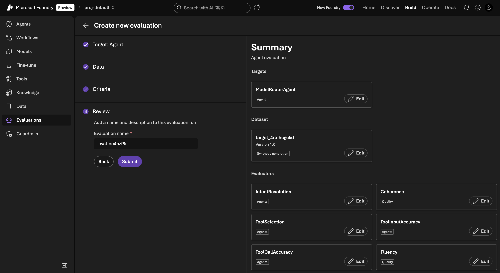
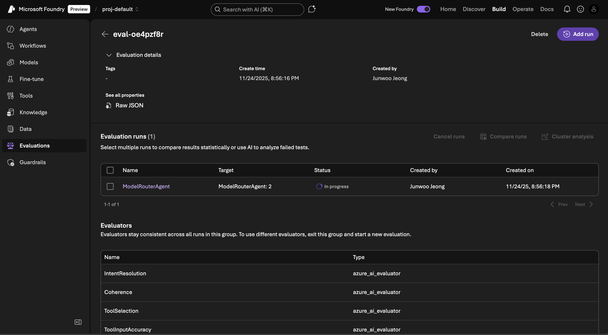

# 06. 평가 (Evaluations)

이 모듈에서는 AI 에이전트와 워크플로우의 성능을 체계적으로 평가하는 방법을 학습합니다.

## 📋 목차

- [평가 개요](#평가-개요)
- [평가 생성](#평가-생성)
- [평가 기준 이해](#평가-기준-이해)
- [평가 실행 및 결과 분석](#평가-실행-및-결과-분석)
- [평가 모범 사례](#평가-모범-사례)
- [다음 단계](#다음-단계)

## 🎯 학습 목표

- AI 에이전트 평가의 중요성 이해
- Foundry의 자동 평가 기능 활용
- 다양한 평가 지표의 의미와 활용법 학습
- 합성 데이터를 사용한 평가 수행
- 평가 결과 해석 및 개선 방안 도출

## ⏱️ 예상 소요 시간

약 10분

---

## 평가 개요

### 왜 평가가 중요한가?

AI 에이전트를 프로덕션에 배포하기 전에 다음 사항을 검증해야 합니다:

```
정확성 → 관련성 → 일관성 → 자연스러움 → 안전성
```

평가 없이 배포하면:
- ❌ 부정확한 답변으로 사용자 신뢰 저하
- ❌ 관련 없는 응답으로 사용자 경험 악화
- ❌ 일관성 없는 품질로 브랜드 이미지 손상
- ❌ 부적절한 콘텐츠 생성으로 법적 문제

### 평가 유형

| 평가 유형 | 설명 | 사용 시기 |
|---------|------|---------|
| **Offline Evaluation** | 배포 전 테스트 데이터로 평가 | 개발 단계 |
| **A/B Testing** | 두 버전 비교 | 프로덕션 배포 시 |
| **Online Monitoring** | 실시간 성능 모니터링 | 운영 중 |
| **Human Evaluation** | 사람이 직접 평가 | 품질 검증 |

### Azure AI Foundry의 평가 기능

Foundry는 다음을 자동화합니다:
- ✅ 테스트 데이터 생성 (Synthetic generation)
- ✅ 다양한 평가 지표 적용
- ✅ 대규모 평가 실행
- ✅ 결과 시각화 및 분석

---

## 평가 생성

이전에 만든 `ModelRouterAgent`를 평가해봅니다.

### 단계별 가이드

1. **Evaluations 섹션 이동**

   - Foundry 포털 좌측 메뉴에서 **Build**를 선택합니다.
   - **Evaluations** 메뉴를 클릭합니다.
   
   

2. **새 평가 생성**

   - **+ Create new evaluation** 또는 **New evaluation** 버튼을 클릭합니다.
   
   

3. **Target 선택**

   평가 대상을 선택합니다:
   
   

   ```
   Target type: Agent
   Agent: ModelRouterAgent
   Version: Latest (또는 특정 버전)
   ```

   **다른 Target 옵션**:
   - **Agent**: 단일 에이전트 평가
   - **Workflow**: 워크플로우 평가
   - **Model**: 모델 직접 평가
   - **Endpoint**: 외부 API 엔드포인트 평가

4. **Data 설정**

   테스트 데이터를 선택합니다:
   
   

   

   

   ```
   Data source: Synthetic generation
   
   Topic: 일반 대화 및 정보 제공
   
   Number of samples: 50
   (더 많은 샘플은 더 신뢰할 수 있지만 시간이 더 걸림)
   
   Languages: Korean, English
   ```

   **Synthetic Generation이란?**
   - AI가 자동으로 다양한 테스트 질문 생성
   - 실제 사용 패턴을 시뮬레이션
   - 수동으로 테스트 케이스를 작성할 필요 없음

   **다른 Data 옵션**:
   - **Upload dataset**: CSV/JSON 파일 업로드
   - **Use existing dataset**: 이전에 저장한 데이터셋 사용

5. **Criteria 선택**

   평가 기준을 선택합니다:

   ```
   ☑ Groundedness (답변이 사실에 기반하는지)
   ☑ Relevance (질문과 답변의 관련성)
   ☑ Coherence (답변의 일관성)
   ☑ Fluency (답변의 자연스러움)
   ```

   

   

      

   

   각 기준에 대한 상세 설명은 아래 섹션을 참조하세요.

6. **Review**

   설정을 검토합니다:
   
   

   

   ```
   Target: ModelRouterAgent (Latest)
   Data: Synthetic (50 samples, Korean/English)
   Criteria: Groundedness, Relevance, Coherence, Fluency
   Estimated time: ~10-15 minutes
   Estimated cost: $2-5 (샘플 수에 따라 다름)
   ```

7. **Submit**

   - 모든 설정을 확인한 후 **Submit** 버튼을 클릭합니다.
   - 평가가 백그라운드에서 실행됩니다.
   - 진행 상황은 Evaluations 페이지에서 확인할 수 있습니다.

### ✅ 확인 사항

- 평가가 "Running" 상태인지 확인
- 예상 완료 시간 확인
- 필요하면 다른 에이전트나 워크플로우 평가도 생성

---

## 평가 기준 이해

각 평가 기준의 의미와 중요성을 이해합니다.

### 1. Groundedness (근거성)

**정의**: 답변이 제공된 컨텍스트나 사실에 기반하는지 평가

```
점수: 1-5
1 = 완전히 근거 없음 (환각)
5 = 완전히 사실에 기반
```

**예시**:

✅ **Good Groundedness (5점)**
```
Q: Microsoft Foundry는 언제 발표되었나요?
A: Microsoft Foundry는 2025년 Microsoft Ignite에서 발표되었습니다.
(사실에 기반한 정확한 답변)
```

❌ **Poor Groundedness (1점)**
```
Q: Microsoft Foundry는 언제 발표되었나요?
A: Microsoft Foundry는 2020년에 발표되어 현재 전 세계에서 가장 많이 사용됩니다.
(잘못된 정보, 과장된 주장)
```

**중요한 이유**:
- 사용자 신뢰 확보
- 법적 책임 최소화
- 허위 정보 확산 방지

### 2. Relevance (관련성)

**정의**: 답변이 질문과 얼마나 관련이 있는지 평가

```
점수: 1-5
1 = 완전히 관련 없음
5 = 완벽하게 관련됨
```

**예시**:

✅ **Good Relevance (5점)**
```
Q: 제주도 날씨가 어때요?
A: 제주도는 현재 맑고 기온은 20도입니다. 오후에 소나기 가능성이 있으니 우산을 챙기세요.
(질문에 직접적으로 답변)
```

❌ **Poor Relevance (2점)**
```
Q: 제주도 날씨가 어때요?
A: 제주도는 한국에서 가장 큰 섬이며 아름다운 해변과 한라산으로 유명합니다.
(질문과 관련 없는 일반 정보)
```

**중요한 이유**:
- 사용자 만족도 향상
- 효율적인 정보 전달
- 대화 흐름 유지

### 3. Coherence (일관성)

**정의**: 답변이 논리적으로 일관되고 구조화되어 있는지 평가

```
점수: 1-5
1 = 논리적으로 혼란스럽고 모순됨
5 = 완벽하게 일관되고 구조화됨
```

**예시**:

✅ **Good Coherence (5점)**
```
Q: 제주도 여행 추천해줘
A: 제주도 여행을 추천드립니다. 
첫째, 자연 경관이 뛰어납니다. 한라산, 성산일출봉 등을 방문할 수 있습니다.
둘째, 다양한 액티비티가 있습니다. 스쿠버 다이빙, 승마 등을 즐길 수 있습니다.
셋째, 맛있는 음식이 많습니다. 흑돼지, 해산물 등이 유명합니다.
(논리적 구조, 일관된 설명)
```

❌ **Poor Coherence (2점)**
```
Q: 제주도 여행 추천해줘
A: 제주도는 좋습니다. 그런데 서울도 좋아요. 한라산이 높고 해산물은 맛있어요. 
비행기 타야 해요. 제주도는 섬입니다. 날씨가 좋을 때 가세요.
(논리 없이 나열, 주제 혼란)
```

**중요한 이유**:
- 이해하기 쉬운 답변
- 전문적인 이미지
- 신뢰성 향상

### 4. Fluency (유창성)

**정의**: 답변이 문법적으로 올바르고 자연스러운지 평가

```
점수: 1-5
1 = 문법 오류 많고 부자연스러움
5 = 완벽한 문법과 자연스러운 표현
```

**예시**:

✅ **Good Fluency (5점)**
```
Q: 여행 경비가 얼마나 드나요?
A: 제주도 2박 3일 여행 경비는 1인당 약 50만원 정도 예상됩니다. 
항공권 15만원, 숙박 20만원, 식비 및 활동비 15만원이 포함됩니다.
(자연스러운 한국어, 명확한 구조)
```

❌ **Poor Fluency (2점)**
```
Q: 여행 경비가 얼마나 드나요?
A: 제주도 여행 비용은 들다. 비행기 값이 있고 호텔도 비용. 
먹는 것과 놀기도 돈 필요합니다 대략입니다.
(어색한 표현, 문법 오류)
```

**중요한 이유**:
- 사용자 경험 향상
- 브랜드 이미지 유지
- 이해도 증가

### 추가 평가 기준 (선택 가능)

| 기준 | 설명 |
|------|------|
| **Completeness** | 답변이 완전한지 (모든 측면 다룸) |
| **Conciseness** | 답변이 간결한지 (불필요한 내용 없음) |
| **Safety** | 유해하거나 부적절한 콘텐츠 없음 |
| **Bias** | 편향되지 않은 공정한 답변 |
| **Factuality** | 사실의 정확성 |

---

## 평가 실행 및 결과 분석

### 평가 진행 상황 확인

1. **Evaluations 페이지**

   - Build > Evaluations로 이동합니다.
   - 실행 중인 평가의 상태를 확인합니다:
     - **Queued**: 대기 중
     - **Running**: 실행 중 (진행률 표시)
     - **Completed**: 완료
     - **Failed**: 실패 (오류 메시지 확인)
   
   

2. **실행 중 정보**

   ```
   Samples processed: 25/50
   Elapsed time: 5 minutes
   Estimated remaining: 5 minutes
   Current cost: $1.20
   ```

### 결과 보기

평가가 완료되면 상세 결과를 확인할 수 있습니다.

1. **Overview**

   

   ```
   Overall Score: 4.2/5.0
   
   Breakdown:
   - Groundedness: 4.5/5.0 (90%)
   - Relevance: 4.3/5.0 (86%)
   - Coherence: 4.1/5.0 (82%)
   - Fluency: 4.0/5.0 (80%)
   
   Total samples: 50
   Pass rate: 84% (42/50 passed)
   ```

2. **Detailed Results**

   각 테스트 샘플의 상세 결과:
   
   

   ```
   Sample #1:
   Question: "Microsoft Foundry가 뭐야?"
   Response: "Microsoft Foundry는 AI 애플리케이션..."
   Scores:
     - Groundedness: 5/5 ✓
     - Relevance: 5/5 ✓
     - Coherence: 4/5 ✓
     - Fluency: 5/5 ✓
   
   Sample #2:
   Question: "AI 모델을 어떻게 배포하나요?"
   Response: "모델 배포는..."
   Scores:
     - Groundedness: 4/5 ✓
     - Relevance: 4/5 ✓
     - Coherence: 3/5 ⚠
     - Fluency: 4/5 ✓
   
   Sample #3:
   Question: "비용은 얼마인가요?"
   Response: "Azure Foundry는 무료입니다..."
   Scores:
     - Groundedness: 2/5 ✗ (부정확한 정보)
     - Relevance: 5/5 ✓
     - Coherence: 4/5 ✓
     - Fluency: 4/5 ✓
   ```

3. **Failed Samples**

   점수가 낮은 샘플들을 필터링하여 확인:
   
   

   ```
   Filter: Groundedness < 3
   
   3개의 샘플 발견:
   - Sample #3: 비용 정보 부정확
   - Sample #15: 출시 날짜 오류
   - Sample #28: 기능 과장
   ```

### 결과 분석

1. **강점 파악**

   ```
   ✅ Groundedness (4.5/5):
   - 대부분의 답변이 사실에 기반
   - 환각(hallucination) 문제 적음
   
   ✅ Relevance (4.3/5):
   - 질문 의도를 잘 파악
   - 관련 있는 정보 제공
   ```

2. **개선 필요 영역**

   ```
   ⚠ Coherence (4.1/5):
   - 일부 답변의 구조 개선 필요
   - 더 논리적인 흐름 필요
   
   ⚠ Fluency (4.0/5):
   - 문장 표현 다듬기
   - 자연스러운 한국어 표현 개선
   ```

3. **Action Items**

   ```
   1. Instructions 개선:
      - 더 구조화된 답변 요청
      - 예시 포함
   
   2. 특정 도메인 지식 추가:
      - 비용 정보 Knowledge Base 추가
      - 출시 일정 등 사실 정보 보강
   
   3. Few-shot Examples 추가:
      - 좋은 답변 예시 제공
      - Prompt에 포함
   ```

### 비교 분석

여러 평가 결과를 비교합니다:


```
ModelRouterAgent v1.0:
- Overall: 4.2/5.0
- Groundedness: 4.5

ModelRouterAgent v1.1 (Instructions 개선 후):
- Overall: 4.5/5.0 (+0.3)
- Groundedness: 4.7 (+0.2)

개선 효과: ✅ 성공
```

### 결과 Export

평가 결과를 다운로드하여 분석:

1. **CSV Export**
   - 모든 샘플과 점수를 CSV로 다운로드
   - Excel이나 다른 도구로 추가 분석

2. **JSON Export**
   - 전체 평가 결과를 JSON으로 다운로드
   - 프로그래매틱 분석 가능

3. **Report Export**
   - PDF 리포트 생성
   - 이해관계자와 공유

---

## 평가 모범 사례

### 1. 적절한 샘플 수 선택

```
개발 단계: 10-20 샘플 (빠른 피드백)
테스트 단계: 50-100 샘플 (신뢰할 수 있는 결과)
프로덕션 검증: 200+ 샘플 (통계적 유의성)
```

### 2. 다양한 시나리오 테스트

```
✅ 테스트해야 할 것:
- 일반 질문
- 복잡한 질문
- 모호한 질문
- 다국어 질문
- Edge cases (극단적 케이스)
```

### 3. 정기적인 평가

```
개발 중: 매 업데이트마다
배포 전: 필수
배포 후: 주간/월간 모니터링
```

### 4. 기준선(Baseline) 설정

```
Minimum Acceptable Scores:
- Groundedness: ≥ 4.0 (필수)
- Relevance: ≥ 3.5
- Coherence: ≥ 3.5
- Fluency: ≥ 3.5

Overall: ≥ 4.0
Pass rate: ≥ 80%
```

### 5. Human Evaluation 병행

```
자동 평가 + 사람 평가 = 최고 품질

주기적으로 사람이 직접:
- 샘플 검토
- 자동 평가의 정확성 확인
- 새로운 문제 패턴 발견
```

---

## 📚 추가 리소스

- [Azure AI Evaluation 개요](https://learn.microsoft.com/en-us/azure/ai-foundry/concepts/observability?view=foundry#what-are-evaluators)
- [파운드리 포털에서 평가 실행](https://learn.microsoft.com/en-us/azure/ai-foundry/how-to/evaluate-generative-ai-app?view=foundry)
- [에이전트 평가](https://learn.microsoft.com/en-us/azure/ai-foundry/concepts/evaluation-evaluators/agent-evaluators?view=foundry)

---

## 다음 단계

에이전트와 워크플로우의 품질을 평가하는 방법을 배웠습니다! 이제 프로덕션 환경에서 리소스를 관리하고 모니터링하는 방법을 학습합니다:

➡️ **[07. Control Plane](./07-control-plane.md)**: Fleet 관리, 모니터링, 컴플라이언스 등을 학습합니다.

---

[← 이전: 워크플로우](./05-workflows.md) | [메인으로](./README.md) | [다음: Control Plane →](./07-control-plane.md)
